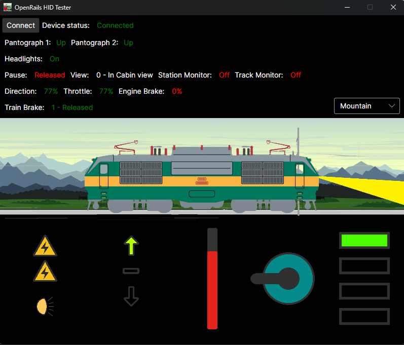

# OpenRails-HID-Tester
Simple tester tool for my custom HID for openrails. Basically just to make debugging easier, also serves as a "health check" for the device. Also wanted to try avalonia.
 
[Link to the GitHub repo containing the HID device](https://github.com/CrusaderSVK287/Rpi-Pico-controller-for-OpenRails)
 
